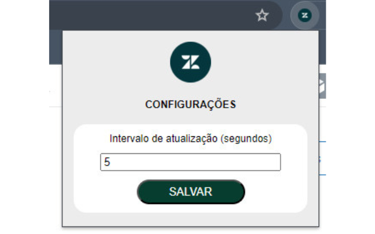
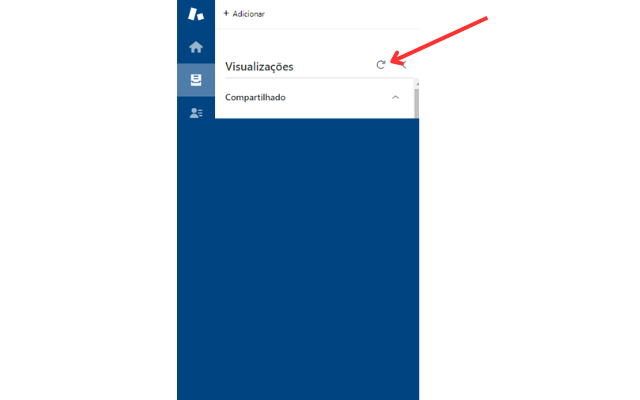

### Zendesk Refresh Agent View

Projeto criado para ser utilizado como app do Google Chrome 
Tem a função de atualizar a página de visualização no Zendesk de acordo com o tempo programado nas configurações 
 

 

Para instalação acesse : https://chromewebstore.google.com/detail/zendesk-atualizar-p%C3%A1gina/klfcnkpjeegbeibebgfkmhbdanfbefhm
